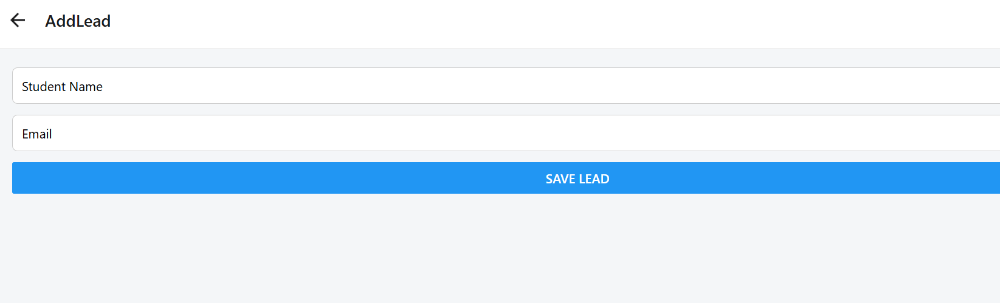
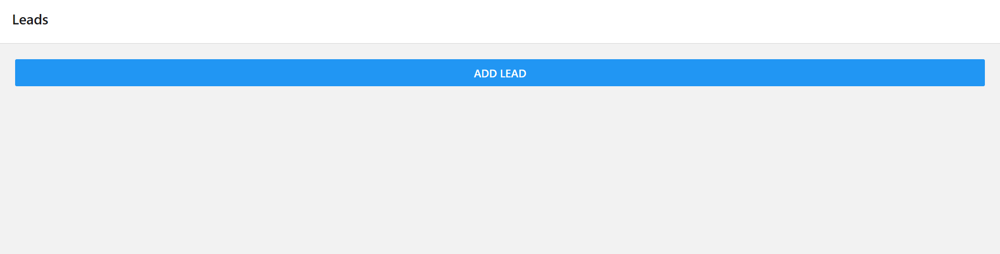
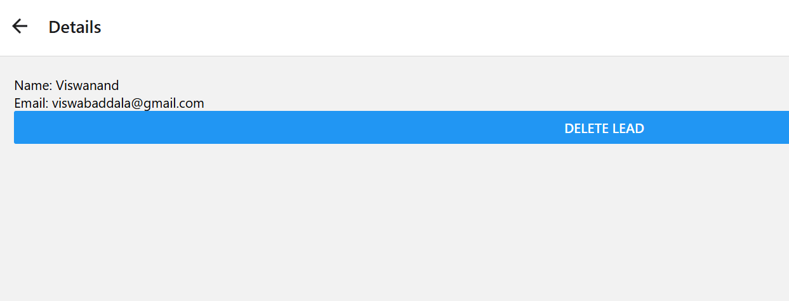

# Student Lead Management App (Mini CRM)

A simple **React Native (Expo)** application that acts as a mini CRM to manage student leads.  
Users can add, view, and delete student leads with persistent local storage.

---

## 🚀 Features

- Add new student leads using a form
- Display leads using `FlatList`
- View lead details on a separate screen
- Delete a student lead
- Stack navigation between screens
- Local data persistence using `AsyncStorage`

---

## 🛠️ Tech Stack

- React Native
- Expo
- React Navigation (Native Stack)
- AsyncStorage
- JavaScript (Functional Components + Hooks)

---

## 📱 Screenshots

### Lead List Screen


### Add Lead Screen


### Lead Detail Screen


---

## ▶️ How to Run the Project

### Prerequisites
- Node.js installed
- Expo Go app installed on mobile

### Steps

```bash
git clone https://github.com/<your-username>/student-lead-management-app.git
cd student-lead-management-app
npm install
npm start
